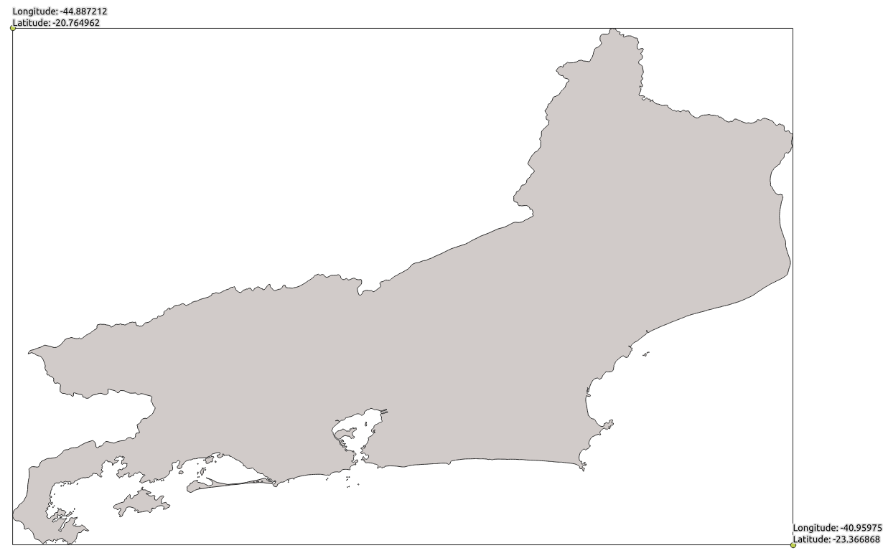

# Criando um sistema para gestão de dados geográficos de forma simples e robusta II

Na [primeira publicação](https://www.linkedin.com/pulse/criando-um-sistema-para-gest%C3%A3o-de-dados-geogr%C3%A1ficos-e-felipe-/) onde exploro a possibilidade de implementar um sistema de gestão de dados geoespaciais com Django, sem a necessidade de usar um servidor com PostGIS, vimos sobre:
* o uso do [`django-geojson`](https://django-geojson.readthedocs.io/en/latest/) para simular um campo geográfico no models;
* o [`geojson`](https://geojson.readthedocs.io/en/latest/) para criar um objeto da classe *geojson* e realizar as validações necessárias para garantir robustez do sistema;  
* a criação do fomulário de registro de dados usando o [`ModelForm`](https://docs.djangoproject.com/en/3.2/topics/forms/modelforms/#modelform);  

Agora é hora de evoluir e expandir um pouco o sistema criado. Nessa publicação vamos:  
* criar validadores de longitude e latitude para poder restringir a inserção de dados a uma determinada região;  
* adicionar uma propriedade ao model que será usada no *popup* do mapa em `leaflet`;
* criar uma view para visualizar os dados em mapas usando `GeoJSONLayerView`, do [`django-geojson`](https://django-geojson.readthedocs.io/en/latest/);
* instalar e usar o [`django-leaflet`](https://django-leaflet.readthedocs.io/en/latest/) para poder usar o `widget` além de outras funcionalidades;
* Tudo isso testando se tais funcionalidades ou propriedades estão com o comportamento esperado;  
* fazer deploy no [heroku](heroku.com)(?)  
    * Um argumento para fazê-lo é levar a implementação até o final.  
    * O leaflet depende de funcionalidades do GDAL. E o heroku possui o [heroku-geo-buildpack](https://github.com/heroku/heroku-geo-buildpack) para isso :heart:  

Vamos lá!

## criando validadores de longitude e latitude  

### Sobre os validadores:  
Os validadores ([`validators`](https://docs.djangoproject.com/en/3.2/ref/forms/validation/#validators) ) fazem parte do sistema de validação de formulários e de campos do Django. Ao criarmos campos de uma determinada classe no nosso model, como por exemplo `integer`, o django cuidará automaticamente da validação do valor passado a este campo pelo formulário, retornando um erro quando o usuário ingressar um valor de texto no campo em questão. O interessante é que além dos validadores já implementados para cada classe, podemos criar outros, conforme a nossa necessidade.

> Por que necesitamos um validador de `latitude` e `longitude`?

Como estou explorando o desenvolvimento de um sistema de gestão de dados goegráficos com recursos limitados, ou seja, sem uma infraestrutura de operações e consultas espaciais, não poderei consultar se o par de coordenadas inserido pelo usuário está contido nos limites de um determinado estado (uma operação clássica com dados geográficos). Não ter essa possibilidade de validação poderá colocar em risco a qualidade do dado inserido.

E como não se abre mão quando a questão é qualidade, uma saída será a criação de validadores personalizados para os campos de `latitude` e `logitude`, garantindo que esses possuem valores condizentes à nossa área de interesse.

**O que precisamos saber:**
os `validators` são funções que recebem um valor, apenas, o valor inserido pelo usuário no campo a ser validado, que passará por uma lógica de validação retornando um [`ValidationError`](https://docs.djangoproject.com/en/3.2/ref/forms/validation/#raising-validation-error) quando o valor inserido não passar nos testes. Com o `ValidationError` podemos customizar uma mensagem de erro, indicando ao usuário o motivo do valor não ter sido considerado válido.  

Então, criarei validadores dos campos de `latitude` e `longitude` para sempre que entrarem com valores que não contemplem a área do estado do Rio de Janeiro, um `ValidationError` será retornado.  

> :warning: Essa não é uma solução ótima já que, dessa forma, estamos considerando o *bounding box* do estado em questão, e com isso haverá áreas onde as coordenadas serão válidas, ainda que não estejam internas ao território estadual. Ainda assim, acredito que seja uma solução boa suficiente para alguns casos, principalmente por não depender de toda infraestrutura de GIS.

**O que é um `bouding box`?**

Bounding box poderia ser traduzido por "retângulo envolvente" do estado, ou de uma feição espacial. Na imagem a baixo, vemos o território do estado do Rio de Janeiro e o retângulo envolvente que limita as suas coordenadas máximas e mínimas de longitude e latitude.  



Percebam que, como mencionado antes, o que conseguimos garantir é que os pares de coordenadas estejam em alguma área interna ao retângulo em questão o que não garante que as mesmas estejam no território do estado do Rio de Janeiro.

## Criando os testes:

Antes de tudo, criamos os testes.
Para isso, criarei uma função chamada `update_values` que receberá um `**kwargs`, que é uma forma de passar a uma função um conjunto de valores nomeados. Nessa função, crio um dicionário tendo como chave os nomes dos campos do meu `ModelForm`, e como valores, os valores esperados a cada campo.

Logo em seguida, crio um objeto chamado `finalData` que será o dicionário `validForm` criado anteriormente, mas com os parâmetros nomeados passados como `**kwargs` da função. Esse dicionário com os valores atualizados serão usadas para instanciar o meu `ModelForm` que será retornado ao fim da execussão.

Fiz isso para poder ir, a cada teste, atualizando apenas os campos que quero simular valores a serem validados, sem ter que instanciar è passar sempre os valores do `ModelForm`.

```python
class FenomenoFormValidatorsTest(TestCase):
    def update_values(self, **kwargs):
        validForm = {  # valid form
            'nome': 'Teste',
            'data': '2020-01-01',
            'hora': '09:12:12',
            'longitude': -42,
            'latitude': -21}

        finalData = dict(validForm, **kwargs)
        form = FenomenoForm(finalData)
        return form
```
Assim, eu posso criar diferentes métodos de *Test Case*, usando o método criando anteriormente para alterar o valor iniciar a um que deva ser considerado inválido pelo validador.

Nos método uso o `assertEqual` para confirmar que o o texto do `AssertError` é o que esperamos. Para saber sobre outros [`assertions`](https://docs.python.org/3/library/unittest.html#unittest.TestCase.debug)

```python
    def test_max_longitude(self):
        form = self.update_values(longitude='-45')
        form.is_valid()
        self.assertEqual(form.errors["longitude"][0], 'Coordenada longitude fora do contexto do estado do Rio de Janeiro')

    def test_min_longitude(self):
        form = self.update_values(longitude='-40')
        form.is_valid()
        self.assertEqual(form.errors["longitude"][0], 'Coordenada longitude fora do contexto do estado do Rio de Janeiro')

    def test_max_latitude(self):
        form = self.update_values(latitude='-24')
        form.is_valid()
        self.assertEqual(form.errors["latitude"][0], 'Coordenada latitude fora do contexto do estado do Rio de Janeiro')

    def test_min_latitude(self):
        form = self.update_values(latitude='-19')
        form.is_valid()
        self.assertEqual(form.errors["latitude"][0], 'Coordenada latitude fora do contexto do estado do Rio de Janeiro')

```

Fazemos rodar os testes e teremos erros como esses:

```python
Creating test database for alias 'default'...
System check identified no issues (0 silenced).
...E.E..
======================================================================
ERROR: test_max_latitude (map_proj.core.tests.FenomenoFormValidatorsTest)
----------------------------------------------------------------------
Traceback (most recent call last):
  File "/media/felipe/DATA/Repos/Django_Leaflet_Test/map_proj/core/tests.py", line 78, in test_max_latitude
    self.assertEqual(form.errors["latitude"][0], 'Coordenada latitude fora do contexto do estado do Rio de Janeiro')
KeyError: 'latitude'

======================================================================
ERROR: test_min_latitude (map_proj.core.tests.FenomenoFormValidatorsTest)
----------------------------------------------------------------------
Traceback (most recent call last):
  File "/media/felipe/DATA/Repos/Django_Leaflet_Test/map_proj/core/tests.py", line 83, in test_min_latitude
    self.assertEqual(form.errors["latitude"][0], 'Coordenada latitude fora do contexto do estado do Rio de Janeiro')
KeyError: 'latitude'

----------------------------------------------------------------------
Ran 8 tests in 0.012s

FAILED (errors=2)
Destroying test database for alias 'default'...

```  

Ou seja, o `forms` após ser validado deveria conter um atributo `errors` tendo como chave o nome do campo que apresentou dados inválidos. Como não temos os validadores criados, ainda, os campos `latitude` não foi encontrado pelo teste executado.

## Criando e usando validadores:

Para superá-los criamos, enfim, os validadores em um arquivo `validators.py`:

```python
# validators.py
from django.core.exceptions import ValidationError


def validate_longitude(lon):
    if lon < -44.887212 or lon > -40.95975:
        raise ValidationError("Coordenada longitude fora do contexto do estado do Rio de Janeiro", "erro longitude")


def validate_latitude(lat):
    if lat < -23.366868 or lat > -20.764962:
        raise ValidationError("Coordenada latitude fora do contexto do estado do Rio de Janeiro", "erro latitude")
```

Com esses validadores estou garantindo que ambos latitude e longitude estejam na área de interesse e, caso contrário, retorno um erro informando ao usuário.

E é preciso adicioná-los ao `forms.py` para que sejam usados:

```python
# forms.py
from map_proj.core.validators import validate_longitude, validate_latitude

class FenomenoForm(ModelForm):
    longitude = FloatField(validators=[validate_longitude])
    latitude = FloatField(validators=[validate_latitude])
...
```

No desenvolvimento dessa solução percebi pelos testes criados que, ao informar uma latitude ou longitude que não passe pela validação, a criação do campo `geom` se tornava inválido (lembre-se que é no método clean do form que o campo `geom` recebe os valores de `longitude` e `latitude` formando uma classe `geojson` para, logo em seguida ser validado) por não receber um desses valores, gerando dois erros: o de validação do campo e o de validação do campo `geom`.

Para evitar isso, alterei o método clean de for a garantir que o campo `geom` só seja criado e validado, quando ambos valores (`longitude` e `latitude`) existam. Ou seja, tenham passado pelos validadores sem erro.

```python
#forms.py
    def clean(self):
        cleaned_data = super().clean()
        lon = cleaned_data.get('longitude')
        lat = cleaned_data.get('latitude')
        if not all((lon, lat)):
            raise ValidationError('Erro em latitude ou longitude')
        
        cleaned_data['geom'] = Point((lon, lat))
        if not cleaned_data['geom'].is_valid:
                raise ValidationError('Geometria inválida')
        
        return cleaned_data

```

## View GeoJSONLayerView

A seriação ou, em inglês `serialization`, é o processo/mecanismo de tradução dos objetos armazenados na base de dados em outros formatos, em geral baseado em texto (por exemplo, XML ou Json), para serem enviados ou consumidos no processo de `request/response`. 

No nosso caso isso será importante pois para apresentar os dados armazenados pelo projeto em um *webmap*, precisaremos servi-los no formato `geojson`. Mas não precisaremos nos preocupar com praticamente nada disso. O `django-geojson` cuida de tudo ao oferecer-nos a classe [`GeoJSONLayerView`](https://django-geojson.readthedocs.io/en/latest/views.html#geojson-layer-view), que é um [*mixin*](https://docs.djangoproject.com/en/3.2/topics/class-based-views/mixins/) que, em base ao modelo informado de nosso projeto, serializa os dados em `geojson` usnado a classe `GeoJSONSerializer` e os serve em uma *view*. É bastante coisa para apenas algumas linhas de código.

Para entender essa sriação, seja o exemplo abaixo. Ao acessar os dados do banco de dados, temos uma `QuerySet`. Ao acessar a geometria de um objeto do bando de dados, temos um `geojson`. Ao serializá-la com o `GeoJSONSerializer`, temos como retorno uma [`FeatureCollection`](https://datatracker.ietf.org/doc/html/rfc7946#section-3.3) já em formato `geojson`, tendo como propriedades os campos do `model`:

```python
>>> Fenomeno.objects.all()
<QuerySet [<Fenomeno: fenomeno_teste>]>

>>> Fenomeno.objects.get(pk=3).geom
{'type': 'Point', 'coordinates': [-42.0, -22.0]}

>>> from djgeojson.serializers import Serializer as GeoJSONSerializer
>>> GeoJSONSerializer().serialize(Fenomeno.objects.all(), use_natural_keys=True, with_modelname=False)
'{"type": "FeatureCollection", "features": [{"type": "Feature", "properties": {"nome": "teste", "data": "2021-06-22", "hora": "02:07:57"}, "id": 3, "geometry": {"type": "Point", "coordinates": [-42.0, -22.0]}}], "crs": {"type": "link", "properties": {"href": "http://spatialreference.org/ref/epsg/4326/", "type": "proj4"}}}'
```

Mais sobre [seriação](https://django-portuguese.readthedocs.io/en/1.0/topics/serialization.html) ou [aqui](https://docs.djangoproject.com/en/3.2/ref/contrib/gis/serializers/), com outro exemplo relacionado a dado geográfico.

Então, ciente de toda a mágica por trás do `GeoJSONLayerView` e o seu resultado, vamos criar os testes para essa `view`.

### Criando os testes da `View`

Como estou testando justamente uma `view` que serializa o objeto do meu odelo em formado geojson e, sabendo que o `geom` só é criado ao usarmos o `ModelForm`, crio uma instância do mesmo, com valores válidos e o salva ao banco (do teste).
Em seguida, teste se o estatus code de um request (metodo "get") ao path que pretendo usar para essa views ("/geojson/"), retorna 200, código que indica sucesso. [Veja mais sobre os códigos aqui](https://en.wikipedia.org/wiki/List_of_HTTP_status_codes).
No último teste, cifirmo se a resposta recebida é a esperada, considerando os dados registrados no formulário do `setUp`.

```python
class FenomenoGeoJsonTest(TestCase):
    def setUp(self):
        self.form = FenomenoForm({
            'nome': 'Teste',
            'data': '2020-01-01',
            'hora': '09:12:12',
            'longitude': -42,
            'latitude': -22})
        self.form.save()

    def teste_geojson_status_code(self):
        self.resp = self.client.get('/geojson/')
        self.assertEqual(200, self.resp.status_code)

    def teste_geojson_FeatureCollection(self):
        self.resp = self.client.get(r('geojson'))
        self.assertEqual(self.resp.json(), {"type": "FeatureCollection", "features": [{"type": "Feature", "properties": {"popup_content": "<strong><span>Nome: </span>Teste</strong></p>", "model": "core.fenomeno"}, "id": 1, "geometry": {"type": "Point", "coordinates": [-42.0, -22.0]}}], "crs": {"type": "name", "properties": {"name": "EPSG:4326"}}})

```

Obviamente, ambos testes falharão, pois ainda não criamos a view, nem a designamos a um *path* do nosso sistema.

Para fazê-los passar, vamos primeiro criar a view. Em `views.py` uma classe nova, herdando da classe `GeoJSONLayerView`. Ela será a view responsável por nos servir os dados do projeto já em `geojson` que serão consumidos em um *webmap*.

O interessante é que também podemos informar o nome da propriedade do modelo em questão, a partir da qual será usada para apresentar informações no *popup* do mapa.

Um último detalhe é que, como estamos usando um `Class Based-View`, ao final a convertemos em view, com o método `as_view()`.

```python
# views.py
from djgeojson.views import GeoJSONLayerView

from map_proj.core.models import Fenomeno


class FenomenoGeoJson(GeoJSONLayerView):
    model = Fenomeno
    properties = ('popup_content',)

    def get_queryset(self):
        context = Fenomeno.objects.all()
        return context

fenomeno_geojson = FenomenoGeoJson.as_view()
```

### Adicionando propriedade para *popup*  

Por agora, adicionarei apenas o campo `nome` à propriedade do meu modelo. Mais à frente podemos incrementar. Mas por agora, só isso.

```python
#models.py
...
    @property
    def popup_content(self):
        popup = f'<strong><span>Nome: </span>{self.nome}</strong></p>'
        return popup
```

Como precisaremos acessar essa view, precisamos incorporá-la na nossa `urls.py`:

```python
# urls.py
from django.contrib import admin
from django.urls import path

from map_proj.core.views import fenomeno_geojson

urlpatterns = [
    path('admin/', admin.site.urls),
    path('geojson/', fenomeno_geojson, name='geojson'),
]

```

Com isso teremos os nossos ultimos testes passando. Se ainda assim  você tiver curiosidade, pode acessar os dados pela *url* `http://127.0.0.1:8000/geojson/` e receberá os dados servidos em `geojson`:

```
{"type": "FeatureCollection", "features": [{"type": "Feature", "properties": {"popup_content": "<strong><span>Nome: </span>teste</strong></p>", "model": "core.fenomeno"}, "id": 3, "geometry": {"type": "Point", "coordinates": [-42.0, -22.0]}}], "crs": {"type": "name", "properties": {"name": "EPSG:4326"}}}
```


# Django-leaflet

Para saber mais sobre o `django-leaflet`, recomendo dar uma olhada na pagina [pypi](https://pypi.org/project/django-leaflet/) e na [documentação](https://django-leaflet.readthedocs.io/en/latest/installation.html). Mas, como eu estive me perguntando "por quê ter e usar um pacote `django-leaflet` se eu posso usar o [`leaflet`](https://leafletjs.com/) "puro", já que se trata de uma biblioteca JavaScript?", deixo alguns puntos que s proprios desenvolvedores apresentam na documentação:

> Main purposes of having a python package for the Leaflet Javascript library :
>  - Install and enjoy ;
>  -  Do not embed Leaflet assets in every Django project ;
>  -  Enjoy geometry edition with Leaflet form widget ;
>  -  Control apparence and settings of maps from Django settings (e.g. at deployment) ;
>  -  Reuse Leaflet map initialization code (e.g. local projections) ;

E por último, mas não menos importante:
> note:	django-leaflet is compatible with django-geojson fields, which allow handling geographic data without spatial database.

Bem legal! ele criaram um pacote já compatível com o pacote `django-geojson`, que nos permite simular campos geomgráficos sem a neccessidade de toda a infraestrutura de uma base de dados de SIG (PostGIS, por exemplo).

Porém, há que ter atenção ao seguinte detalhe:
> #### Dependencies
> django-leaflet requires the GDAL library installed on the system. Installation instructions are platform-specific.

```python
# Leaflet JS
var layer = L.geoJson();
map.addLayer(layer);
$.getJSON("", function (data) {
    layer.addData(data);
});
```
```python
# views.py
from djgeojson.views import GeoJSONLayerView

class MapLayer(GeoJSONLayerView):
    # Options
    precision = 4   # float
    simplify = 0.5  # generalization


# urls.py
from .views import MapLayer, MeetingLayer
...
url(r'^mushrooms.geojson$', MapLayer.as_view(model=MushroomSpot, properties=('name',)), name='mushrooms')
```

#### Add statics urls

```python
STATIC_URL = '/static/'
MEDIA_URL = '/media/'
MEDIA_ROOT = BASE_DIR
```


## Heroku
como funciona: https://dzone.com/articles/how-heroku-works
