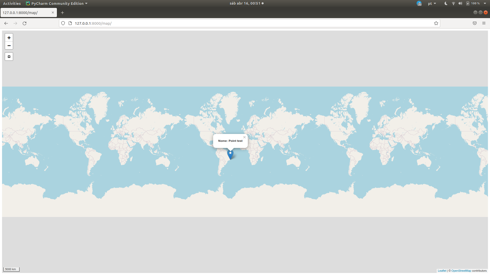

# Criando um sistema para gestão de dados geográficos de forma simples e robusta III

Caso não tenha visto as publicações anteriores, deixo aqui o *link* e os temas abordados:
 1. [Na primeira publicação](https://www.linkedin.com/pulse/criando-um-sistema-para-gest%C3%A3o-de-dados-geogr%C3%A1ficos-e-felipe-/) falo sobre o [`django-geojson`](https://django-geojson.readthedocs.io/en/latest/) para simular um campo geográfico no models; o [`geojson`](https://geojson.readthedocs.io/en/latest/) para criar um objeto da classe *geojson* e realizar as validações necessárias para garantir robustez do sistema, e a criação do formulário de registro de dados usando o [`ModelForm`](https://docs.djangoproject.com/en/3.2/topics/forms/modelforms/#modelform);
 1. [Na segunda publicação](https://www.linkedin.com/pulse/criando-um-sistema-para-gest%C3%A3o-de-dados-geogr%C3%A1ficos-e-felipe--1e/) apresento os validadores de campo do `Django` como uma ferramenta fundamental na qualidade dos dados espaciais, **sem depender de infraestrutura GIS**.

Agora, a ideia é implementar um *webmap* usando o módulo [`django-leaflet`](https://django-leaflet.readthedocs.io/en/latest/) para apresentar os fenômenos mapeados com algumas informações no *popup* do mapa. Para isso iremos:

* usar o `GeoJSONLayerView`, do [`django-geojson`](https://django-geojson.readthedocs.io/en/latest/) para retornar os dados salvos no formato apropriado para exibição no *webmap*;  
* usar o [`django-leaflet`](https://django-leaflet.readthedocs.io/en/latest/) para, além de implementar o *webmap*, podermos usar várias outras ferramentas (`widget`);

Vamos lá!

## View GeoJSONLayerView

A serialização ou, em inglês `serialization`, é o processo/mecanismo de tradução dos objetos armazenados na base de dados em outros formatos (em geral, baseado em texto como, por exemplo, XML ou JSON), para serem enviados ou consumidos no processo de *request/response*.

No nosso caso isso será importante, pois para apresentar os dados salvos em um *webmap*, precisaremos servi-los no formato `geojson`. E é aí que o `django-geojson` entra. Nós o utilizaremos para fazer a mágica acontecer ao usar a classe [`GeoJSONLayerView`](https://django-geojson.readthedocs.io/en/latest/views.html#geojson-layer-view).

A classe `GeoJSONLayerView` é um [`mixin`](https://docs.djangoproject.com/en/3.2/topics/class-based-views/mixins/) que, em base ao modelo informado do nosso projeto, serializa os dados transformando-os em `geojson` e os servindo em uma `view`. Acredite, é bastante coisa para apenas algumas linhas de código.

Para entender a serialização, segue um exemplo...  

Ao acessar os dados do banco de dados, temos uma `QuerySet`.

```python
>>> Fenomeno.objects.all()
<QuerySet [<Fenomeno: fenomeno_teste>]>
```

Ao acessar a geometria de um objeto do banco de dados, temos um `geojson`.

```python
>>> Fenomeno.objects.get(pk=3).geom
{'type': 'Point', 'coordinates': [-42.0, -22.0]}
```

Ao serializá-lo com o `GeoJSONSerializer`, temos como retorno uma [`FeatureCollection`](https://datatracker.ietf.org/doc/html/rfc7946#section-3.3) seguindo o formato `geojson`, tendo como propriedades os campos do `model`:

```python
>>> from djgeojson.serializers import Serializer as GeoJSONSerializer
>>> GeoJSONSerializer().serialize(Fenomeno.objects.all(), use_natural_keys=True, with_modelname=False)
'{'crs': {'properties': {'href': 'http://spatialreference.org/ref/epsg/4326/',
                        'type': 'proj4'},
         'type': 'link'},
 'features': [{'geometry': {'coordinates': [-42.0, -22.0], 'type': 'Point'},
               'id': 3,
               'properties': {'data': '2021-06-22',
                              'hora': '02:07:57',
                              'nome': 'teste'},
               'type': 'Feature'}],
 'type': 'FeatureCollection'}'
```

Mais sobre serialização pode ser encontrado [aqui](https://django-portuguese.readthedocs.io/en/1.0/topics/serialization.html) ou [aqui, com outro exemplo relacionado a dado geográfico usando o GeoDjango](https://docs.djangoproject.com/en/3.2/ref/contrib/gis/serializers/).

Então, ciente de toda a mágica por trás do `GeoJSONLayerView` e o seu resultado, vamos criar os testes para essa `view`.

### Criando os testes da `view`

Como estou testando justamente uma `view` que serializa o objeto do meu modelo salvo no banco em formato `geojson` precisarei adicionar ao `setUp` do meu `TestCase` valores válidos ao banco de dados do teste. Sem isso, não poderemos confirmar se a serialização está ocorrendo de forma correta. E, uma vez salvo um conjunto básico de testes:

- Confirmo se o *status code* do request (método "get") ao *path* que pretendo usar para essa views (no caso, "/geojson/"), retorna 200, código que indica sucesso no processo de *request/response*. [Veja mais sobre os códigos aqui](https://en.wikipedia.org/wiki/List_of_HTTP_status_codes).

- Em seguida, confirmo se a resposta recebida é uma `FetureCollection` com os dados da instância criada anteriormente.

```python
# testes.py
class FenomenoGeoJsonTest(TestCase):
    def setUp(self):
        self.form = Fenomeno.objects.create(
            nome="Teste",
            data="2020-01-01",
            hora="09:12:12",
            geom={"type": "Point", "coordinates": [-42, -22]},
        )

    def teste_geojson_status_code(self):
        self.resp = self.client.get(r("geojson"))
        self.assertEqual(200, self.resp.status_code)

    def teste_path_geojson_returns_valid_feature_collection(self):
        self.resp = self.client.get(r("geojson"))
        self.assertEqual(
            self.resp.json(),
            {
                "type": "FeatureCollection",
                "features": [
                    {
                        "type": "Feature",
                        "properties": {
                            "popup_content": "<p><strong><span>Nome: </span>Teste</strong></p>",
                            "model": "core.fenomeno",
                        },
                        "id": 1,
                        "geometry": {"type": "Point", "coordinates": [-42.0, -22.0]},
                    }
                ],
                "crs": {"type": "name", "properties": {"name": "EPSG:4326"}},
            },
        )

```

Obviamente, ambos testes falharão, pois, ainda não criamos a view e nem a designamos a um *path* do nosso sistema.

Para fazê-los passar, vamos primeiro criar a view: Em `views.py` criaremos uma classe nova, herdando da classe `GeoJSONLayerView`. Ela será a view responsável por resgatar os dados e servir-nos como uma `FeatureCollection` seguindo a estrutura de um `geojson`.

Um último detalhe é que, como estamos usando um `Class Based-View`, ao final a convertemos em view, com o método `as_view()`.

```python
# views.py
from djgeojson.views import GeoJSONLayerView

from map_proj.core.models import Fenomeno


class FenomenoGeoJson(GeoJSONLayerView):
    model = Fenomeno
    properties = ("popup_content",)


fenomeno_geojson = FenomenoGeoJson.as_view()

```

### Adicionando propriedade para *popup*

Percebam que no `teste_geojson_FeatureCollection` eu já estou considerando que o `geojson` virá com `properties` com o nome de `popup-content`. Essa `property` ainda deverá ser criada no model em questão e poderá ter quantas informações acharmos pertinentes. Se tratam das informações do model a serem apresentadas no *popup* do mapa. 

Por agora estou apenas informando o nome do fenômeno mapeado mas, mais à frente, podemos incrementar, adicionando um [`get_absolute_url`](https://docs.djangoproject.com/en/3.2/ref/models/instances/#get-absolute-url) por exemplo, para poder acessar aos detalhes do fenômeno diretamente a partir do *popup* do mapa.

```python
#models.py
...
    @property
    def popup_content(self):
        return self.nome
```

### Adicionando um *path* a `view`

Para poder acessar essa view, precisamos incorporá-la na nossa `urls.py`:

```python
# urls.py
from django.contrib import admin
from django.urls import path

from map_proj.core.views import fenomeno_geojson # novo!

urlpatterns = [
    path("admin/", admin.site.urls),
    path("geojson/", fenomeno_geojson, name="geojson"), # novo!
]

```

Com isso teremos os nossos últimos testes passando. Se ainda assim você tiver curiosidade, pode executar o `runserver` e acessar os dados pela *url* `http://127.0.0.1:8000/geojson/`. O resultado esperado são os dados servidos em `geojson`:

```
{
                "type": "FeatureCollection",
                "features": [
                    {
                        "type": "Feature",
                        "properties": {
                            "popup_content": "<p><strong><span>Nome: </span>Teste</strong></p>",
                            "model": "core.fenomeno",
                        },
                        "id": 1,
                        "geometry": {"type": "Point", "coordinates": [-42.0, -22.0]},
                    }
                ],
                "crs": {"type": "name", "properties": {"name": "EPSG:4326"}},
            }
```

:warning: Garanta que você já tenha inserido algum dado ao seu projeto ;)

Pronto, já temos uma `view` nos servindo os dados em formato `geojson`. Vamos ao `Django-leaflet`, para entender como montar um *webmap*.

## Django-leaflet

Para saber mais sobre o `django-leaflet`, recomendo dar uma olhada na página [pypi](https://pypi.org/project/django-leaflet/) e na [documentação](https://django-leaflet.readthedocs.io/en/latest/installation.html). 

Você deve estar se perguntando: "por quê usar o `django-leaflet` se eu posso usar o [`leaflet`](https://leafletjs.com/) "puro", já que se trata de uma biblioteca JavaScript para produção do mapa no *frontend*?".

Os autores do projeto `django-leaflet` deixam alguns pontos que justificam sua adoção na página da documentação. Das quais eu destaco:
- Possibilidade de uso das ferramentas de edição de geometría usando os `widget`;
- Fácil integração dos `widgets` na página `admin`;
- Controle da aparência dos mapas a partir do Django `settings.py`;

:warning: E por último, mas não menos importante:
> `django-leaflet` é compatível com os campos  `django-geojson`, o que permite o uso de dados geográficos sem a necessidade de uma base de dados espaciais. O motivo de toda essa série que tenho produzido :)

Bem legal! Eles criaram um pacote já compatível com o pacote `django-geojson`, que nos permite simular campos geográficos sem a necessidade de toda a infraestrutura de uma base de dados de SIG (PostGIS, por exemplo).

:warning: Porém, atenção ao seguinte detalhe:+
> O `django-leaflet` depende da biblioteca [GDAL](https://pypi.org/project/GDAL/), não se esqueça de instalá-la antes.

### Instalando `django-leaflet`

```python
pip install django-leaflet
```

Após a sua instalação é necessário incluí-lo no `settings.py` como *INSTALLED_APPS*. :warning: Não esqueça de adicioná-lo ao `requirements.txt` do projeto, também.

```python
# settings.py
INSTALLED_APPS = [
    ...
    'djgeojson',
    'leaflet', # novo
    ...
]
```

### Usando o leaflet

Com `leaflet` instalado, devemos então:

1. Na pasta da nossa *app*, vamos criar uma pasta chamada "templates";
2. E nessa pasta, criar um arquivo HTML (neste caso vou chamar de "map.html";
3. Nessa página vamos carregar as [`template_tags`](https://www.geeksforgeeks.org/django-template-tags/) do `leaflet` para poder usar `leaflet_js`, `leaflet_css` e o `leaflet_map`:

```html


<head>
    ...
    
    
</head>
...
<body>
    ...
    
    ...
</body>

```

Essas [`template_tags`](https://github.com/makinacorpus/django-leaflet/blob/master/leaflet/templatetags/leaflet_tags.py) irão tentar acessar as configurações do `leaflet` presentes no `settings.py` da app, caso existam. Do contrário, serão usados valores padrão de configuração. O interessante dessas `template_tags` é que com elas podemos customizar tais configurações a cada *template*;

5. Como a ideia é apenas renderizar essa página, vou adicionar ao `urls.py` um *path* a ela, usando o [`TemplateView`](https://docs.djangoproject.com/en/4.0/topics/class-based-views/#basic-examples). Com isso, ao receber um *request* neste *path*, a responsta será direcionada à renderização dessa página:  

```python
#urls.py
from django.contrib import admin
from django.urls import path
from django.views.generic import TemplateView

from map_proj.core.views import fenomeno_geojson

urlpatterns = [
    path("admin/", admin.site.urls),
    path("geojson/", fenomeno_geojson, name="geojson"),
    path("map/", TemplateView.as_view(template_name="map.html"), name="map"),
]

```

Isso já o suficiente para termos nosso *webmap* apresentado:


Imagino que não seja o que esperava, né? Mas fique calmo, já vamos ver como alterar as configurações do mapa. 

Antes disso, vamos "linkar" a view que nos serve o `geojson` com os dados salvos no banco com o *webmap* em questão, para que os dados sejam apresentados.

### Renderizando o `geojson` no mapa

Lembra que temos uma view que serializa os dados armazenados no banco e nos serve como uma `FeatureCollection` e que podemos acessar tais dados pelo *path* *geojson/*?

Então, iremos adicionar um *script* à nossa página no qual uma variável `dataurl` receberá os dados dessa *url* adicionando tais dados ao mapa, assim que o mesmo for inicializado, desencadeando o processo de construção da *popup* de cada feição apresentada com sua posterior inserção ao mapa:

```html


    <script>
      var dataurl = '';

      window.addEventListener("map:init", function (event) {
        var map = event.detail.map;
        // Download GeoJSON data with Ajax
        fetch(dataurl)
          .then(function(resp) {
            return resp.json();
          })
          .then(function(data) {
            L.geoJson(data, {
              onEachFeature: function onEachFeature(feature, layer) {
                var props = "<p><strong><span>Nome: </span> " + feature.properties.popup_content + "</strong></p>";
                layer.bindPopup(props);
            }}).addTo(map);
          });
      });

    </script>


<head>
    
    
</head>
<body>



</body>

```

Veja que para a criação da variável `dataurl` estamos usando a `template_tag` do django:
`var dataurl = '';`

Veja mais sobre ela [aqui](https://docs.djangoproject.com/en/4.0/ref/templates/builtins/#url).

Repare também que, neste processo, a cada `Feature`, será carregada as suas propriedades a serem apresentadas no *popup*:

```python
L.geoJson(data, {
              onEachFeature: function onEachFeature(feature, layer) {
                var props = "<p><strong><span>Nome: </span> " + feature.properties.popup_content + "</strong></p>";
                layer.bindPopup(props);
            }}).addTo(map);
```

Com o `runserver` em execução, já poderemos ver o nosso mapa com o dado carregado e as propriedades que definimos no *popup*:


:warning: Garanta que você já tenha inserido algum dado ao seu projeto ;)

**Mudando a tamanho do *webmap*:**

Antes de passarmos às configurações do `leaflet`, podemos alterar as dimensões do mapa definindo um `style`. Por exemplo, para que o mapa ocupe toda a área possível do navegador, basta adicionarmos:

```html
<style>
    #yourmap {
        width: 100%;
        height: 100%;
    }
</style>
```



### Configurações do leaflet

Bom, além das `template_tags` do leaflet, o uso do `django-leaflet` nos permite definirmos as suas configurações no `settings.py` da `app`, a partir da seção `LEAFLET_CONFIG`.

Dentre as [configurações possíveis](https://django-leaflet.readthedocs.io/en/latest/templates.html#configuration)
, vou usar apenas o par de coordenadas ao qual o mapa deverá estar centralizado por padrão (`DEFAULT_CENTER`) e o zoom padrão (`DEFAULT_ZOOM`):

```python
LEAFLET_CONFIG = {
    'DEFAULT_CENTER': (-22, -42),
    'DEFAULT_ZOOM': 7,
}
```

Com isso nosso mapa sempre será apresentado centralizado nas coordenadas (-22, -42) e com o zoom 7:


Pronto, com os artigos já publicados, já temos um sistema com formulário de inserção de dados, com as devidas validações dos dados preenchidos no mesmo, assim como um *webmap* apresentando-os ao mundo :-).

Na próxima publicação vamos ver como fazer o *deploy* desse sistema no [heroku](https://www.heroku.com/) :rocket:.

Até lá!